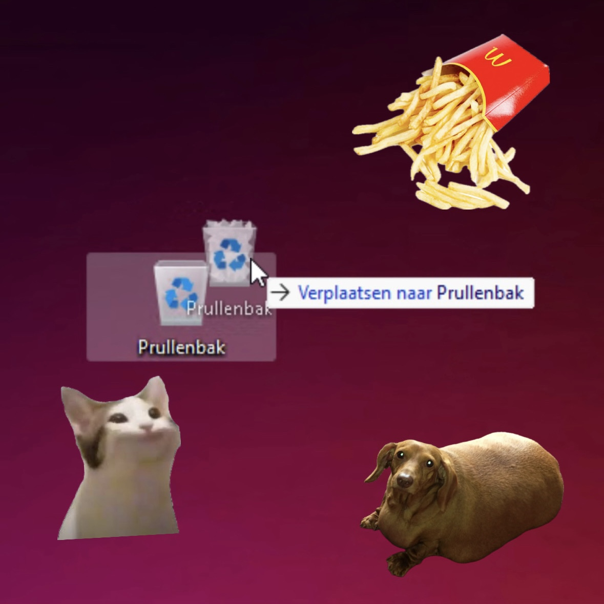
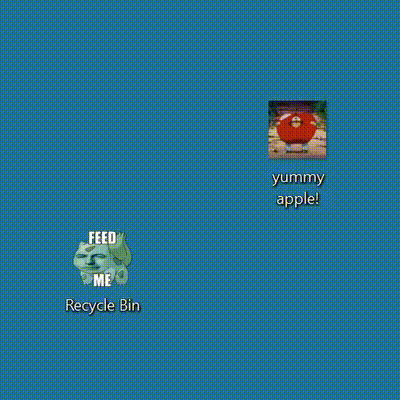
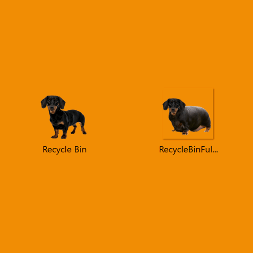
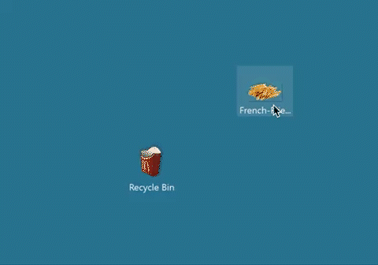

<h1 align="center">
<br>
  Windows Recyclebin Themes 
</h1>
<p align="center">
<span>Inspired by <a href="https://reddit.com/r/pcmasterrace/comments/uvtdbx/cat_bin/">this Reddit post</a> by <a href="https://reddit.com/user/DARKplayz_">u/DARKplayz_</a></span>
</p>
<p align="center">
<span>Script extended from <a href="https://www.reddit.com/r/pcmasterrace/comments/uw2se4/comment/i9qby36/?utm_source=share&utm_medium=web2x&context=3/">this Reddit post</a> by <a href="https://reddit.com/user/ur_opinion_is_wrong">u/ur_opinion_is_wrong</a></span>
</p>
<p align="center">
<span>And by all the forks from <a href="https://github.com/sdushantha/recycle-bin-themes">this repository</a> by <a href="https://reddit.com/user/rushedcar">u/rushedcar</a></span>
</p>


## Preview Available Themes

> Click to expand

<details>
<summary><b>Pop Cat</b></summary>

<br>
<b><a href="https://github.com/technoluc/recycle-bin-themes/tree/main/themes/pop-cat">[View Icons]</a></b>
</details>

<details>
<summary><b>Patrick Star</b></summary>

<br>
<b><a href="https://github.com/technoluc/recycle-bin-themes/tree/main/themes/patrick-star">[View Icons]</a></b>
</details>

<details>
<summary><b>Kirby</b></summary>

<br>
<b><a href="https://github.com/technoluc/recycle-bin-themes/tree/main/themes/kirby">[View Icons]</a></b>
</details>

<details>
<summary><b>Bulbasaul</b></summary>

<br>
<b><a href="https://github.com/technoluc/recycle-bin-themes/tree/main/themes/bulbasaul">[View Icons]</a></b>
</details>

<details>
<summary><b>Kanna</b></summary>

<br>
<b><a href="https://github.com/technoluc/recycle-bin-themes/tree/main/themes/kanna">[View Icons]</a></b>
</details>

<details>
<summary><b>Sword Kirby</b></summary>

<br>
<b><a href="https://github.com/technoluc/recycle-bin-themes/tree/main/themes/sword-kirby">[View Icons]</a></b>
</details>

<details>
<summary><b>Dachshund</b></summary>

<br>
<b><a href="https://github.com/sdushantha/recycle-bin-themes/tree/main/themes/dachshund">[View Icons]</a></b>
</details>

<details>
<summary><b>French Fries</b></summary>

<br>
<b><a href="https://github.com/sdushantha/recycle-bin-themes/tree/main/themes/french-fries">[View Icons]</a></b>
</details>

<details>
<summary><b>Minecraft Chest</b></summary>

<br>
<b><a href="https://github.com/sdushantha/recycle-bin-themes/tree/main/themes/minecraft-chest">[View Icons]</a></b>
</details>

# How to change the Recycle Bin icon

## Run in powershell:

Terminal based:

```powershell
iwr -useb https://raw.githubusercontent.com/technoluc/recycle-bin-themes/main/RecycleBinThemes.ps1 | iex
```

Or with GUI:

```powershell
irm get.technoluc.nl/bin | iex
```

In case above link is broken:
```powershell
irm https://raw.githubusercontent.com/technoluc/recycle-bin-themes/main/RecycleBinThemesGUI.ps1 | iex
```

### What it does
1. Downloads the two icons of selected choice ending with `empty.ico` and `full.ico`
2. Changes the icon for **Recycle Bin (full)** with the icon ending with `full.ico` and **Recycle Bin (empty)** with `empty.ico`
3. Modifies the [Registry](https://support.microsoft.com/en-us/windows/how-to-open-registry-editor-in-windows-10-deab38e6-91d6-e0aa-4b7c-8878d9e07b11), specifically **HKey_Current_User** > **Software** > **Microsoft** > **Windows** > **CurrentVersion** > **Explorer** > **CLSID** > **{645FF...}** > **DefaultIcon**
4. Edits the files (**Default**, **empty**, and **full**) and in the **Value Data** adds a **comma** and **0** at the end after **.ico**. (It will look like `.ico,0`)


# Changelog for Recycle Bin Theme Changer:

### Version 1.0.1 (Original)
- Original release by Siddharth Dushantha.
- Static list of supported themes.
- Basic console-based interface for theme selection.
- Direct download of icons from GitHub.
- Registry modifications for Recycle Bin icon customization.
- Limited user feedback and error handling.

### Version 2.0.0 (RecycleBinThemes.ps1)
- Updated by TechnoLuc with customization.
- Dynamically fetches theme names from GitHub repository.
- Colorful and user-friendly console interface with improved prompts.
- Displays a colorful header with script information.
- Validates user input for theme selection.
- Enhanced success messages in green for better visibility.
- User prompted to press Enter before exiting.
- Improved error handling.
- GitHub repository URL updated to the customized repository.

### Version 3.0.0 (RecycleBinThemesGUI.ps1)
- Major update with a graphical user interface (GUI) using WPF.
- Introduces a window with image previews, theme selection, and action buttons.
- Fetches themes dynamically from GitHub repository using `Invoke-RestMethod`.
- Processes and stores theme names in a hashtable for display.
- Error handling using `trap` statement with user-friendly notifications.
- Functions for setting Recycle Bin icons (`writeToDefaultIconRegistry`, `Set-RecycleBinIcon`).
- ListBox for displaying and selecting themes with improved visual representation.
- Dynamic image preview for the selected theme.
- Apply and Default buttons with corresponding actions.
- Responsive UI with SizeChanged event handling for layout adjustments.
- User notifications displayed using message boxes (`ShowMessage` function).
- Overall improved user experience with a more advanced and visually appealing interface.


## Contribution
1. Fork the repo
2. Make directory with the name of your icon theme, inside the `themes` directory. Make sure to have the following file structure:
```
your-theme-name/
├── your-theme-name-empty.ico
├── your-theme-name-full.ico
└── preview.gif  
```
3. Add your theme name to the [`RecycleBinThemes.ps1`](./RecycleBinThemes.ps1) file to the `$supported_themes` array
4. Create GIF of your theme in action. Make sure you set the your wallpaper to the color `#2d7d9a`. This is so that all the previews have a similar style.
5. Send a pull request :)

*Credits: https://reddit.com/r/pcmasterrace/comments/uvtdbx/cat_bin/i9nn1pq/*